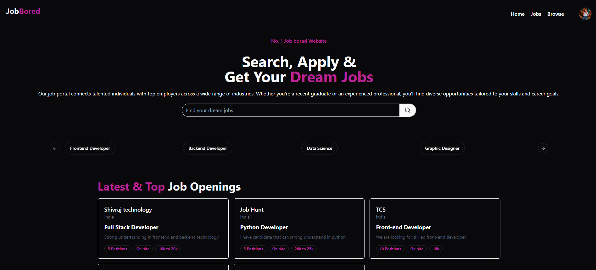
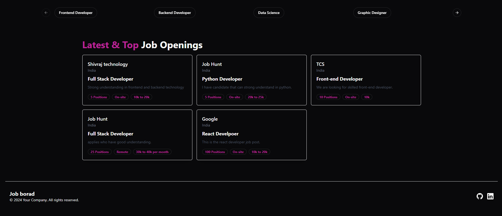
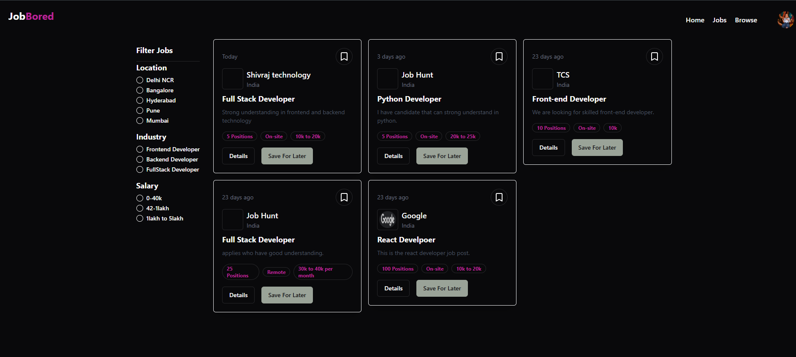
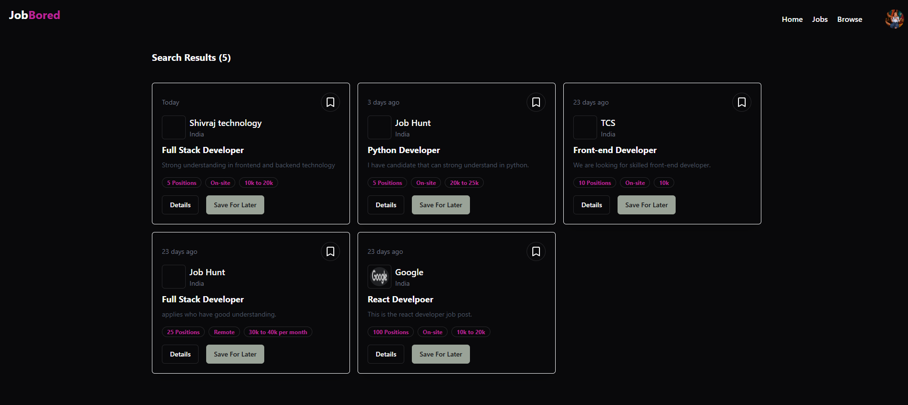
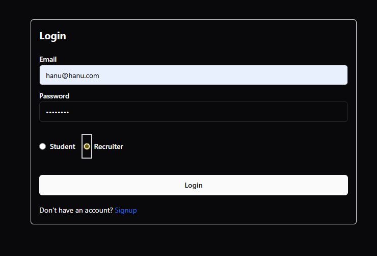
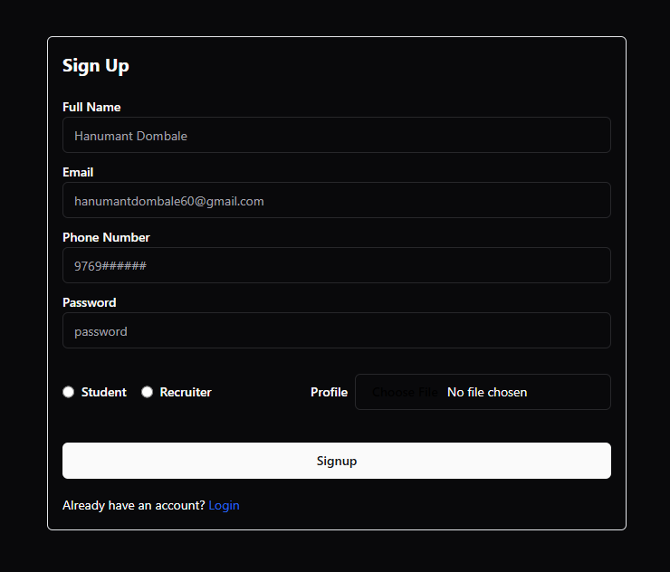
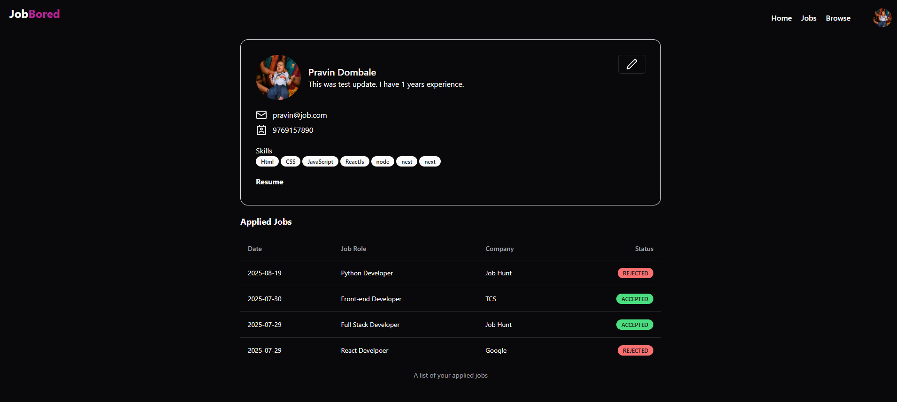
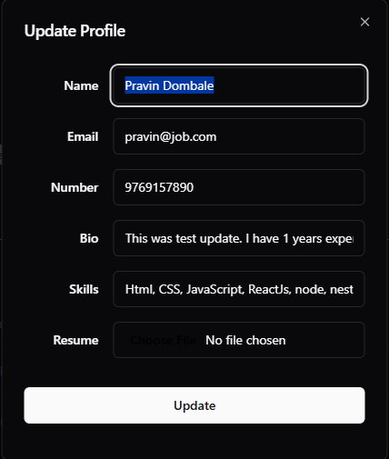
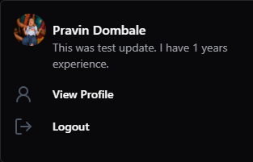

# CodSoft Task 2 – Job Board Application

This project is a Job Board Application built with the MERN stack (MongoDB, Express, React, Node.js). It allows employers to post job listings and job seekers to browse and apply for jobs. The app provides a user-friendly interface, secure backend, and essential features to connect candidates with opportunities.

### Why it was built?

This project was built as a hands-on learning exercise to strengthen full-stack development skills using the MERN stack. By building a job board application, I practiced designing RESTful APIs, managing state in React, handling database operations with MongoDB, and deploying a complete frontend–backend system. It also helped me simulate a real-world project where multiple user roles (employers and job seekers) interact with shared data.

<br>

# Demo Or Screenshot

check out project :- [Live Site](https://jobboardapplication.netlify.app/)

Website preview:-

-   Home page: <br>
    
    

-   Filter jobs & Browse page:<br>
    
    

-   Login page:<br>
    

-   Sign up page:<br>
    

-   Profile page:<br>
    

-   Update page:<br>
    

-   Navigation page:<br>
    

<br>

# 🚀 Tech Stack

-   Frontend: React.js (JavaScript) – for building a responsive and dynamic user interface.

-   Backend: Node.js with Express.js (JavaScript) – for server-side logic and RESTful APIs.

-   Database: MongoDB (NoSQL, JSON-based queries) – for storing job posts, users, and applications.

-   Deployment: [Netlify](https://jobboardapplication.netlify.app/) & [Render](https://backend-job-board.onrender.com) – for hosting and deployment.

<br>

# ⚙️ Installation & Setup

To run this project locally, you need to set up both the frontend and backend.
The frontend handles the user interface, while the backend manages APIs, database operations, and business logic.
Follow the steps below to install dependencies, start servers, and run the application on your machine.

### Clone the Repository

```
git clone https://github.com/hanumant-dombale/CodSoft-Task-2.git

cd CodSoft-Task-2
```

### Frontend Setup

```
cd frontend
npm install
npm run dev
```

### Backend Setup

```
cd backend
npm install
npm run dev Or npm start
```

<br>

# 🔑 Environment Variables

### Backend

```
# Database
MONGODB_URI=your-mongodb-connection-string

# Server
PORT=5000
NODE_ENV=development

# Cloudinary (for file uploads: resumes, images, etc.)
CLOUDINARY_CLOUD_NAME=your-cloudinary-cloud-name
CLOUDINARY_API_KEY=your-cloudinary-api-key
CLOUDINARY_API_SECRET=your-cloudinary-api-secret

# Authentication
JWT_SECRET_KEY=your-jwt-secret-key

# CORS / Allowed Origins
ALLOWED_ORIGIN=http://localhost:3000
```

#### 📝 Explanation of Variables

-   MONGODB_URI → Connection string for MongoDB (Atlas or local).

-   PORT → Port for the backend server (default 5000).

-   NODE_ENV → Environment type (development | production).

-   CLOUDINARY_CLOUD_NAME / API_KEY / API_SECRET → Required if you’re using Cloudinary for file/image uploads.

-   JWT_SECRET_KEY → Secret used to sign & verify JSON Web Tokens.

-   ALLOWED_ORIGIN → Frontend URL allowed to access the backend (e.g., http://localhost:3000 in dev, or your Netlify domain in prod).

### Frontend

```
# Backend API base URL
VITE_API_BASE=http://localhost:5000

```

#### 📝 Explanation

-   VITE_API_BASE → Points your frontend to the backend API.

    -   In development, set it to http://localhost:5000.

    -   In production, replace it with your deployed backend URL (e.g., https://your-backend.onrender.com).

<br>

# 📂 Project Structure

### Root

```
CodSoft-Task-2/
│
├── backend/              # Node.js + Express backend
├── frontend/             # React frontend (Vite + TailwindCSS)
├── .gitignore            # Files ignored by Git
├── README.md             # Project documentation
```

### Backend

```
backend/
│
├── controllers/          # Business logic for handling requests (e.g., job, user)
├── middlewares/          # Authentication & error handling middlewares
├── models/               # Mongoose models (e.g., Job.js, User.js)
├── routes/               # API route definitions
├── utils/                # Helper functions (e.g., validation, tokens)
│
├── app.js                # Express app configuration
├── index.js              # Entry point, starts the server
├── .env.sample           # Sample environment variables
├── package.json          # Backend dependencies & scripts
└── README.md             # Backend-specific docs
```

### Frontend

```
frontend/
│
├── src/                  # Main React source code
│   ├── components/       # UI & functional components
│   │   ├── admin/        # Admin dashboard components
│   │   ├── auth/         # Authentication components (login/signup)
│   │   ├── shared/       # Shared reusable components
│   │   └── ui/           # UI components (cards, sections, dialogs)
│   │
│   ├── hooks/            # Custom React hooks
│   ├── lib/              # Utility functions/libraries
│   ├── redux/            # Redux store, slices, and state management
│   │
│   ├── App.jsx           # Root React component
│   ├── main.jsx          # Entry point for React app
│   ├── index.css         # Global styles
│
├── public/               # Public assets (favicon, images, etc.)
│
├── .env.sample           # Sample environment variables
├── netlify.toml          # Netlify deployment configuration
├── tailwind.config.js    # TailwindCSS configuration
├── vite.config.js        # Vite configuration
├── package.json          # Frontend dependencies & scripts
└── README.md             # Frontend-specific docs

```

### ✅ In summary:

-   Backend → Handles API, database (MongoDB), authentication, and business logic.

-   Frontend → React app with TailwindCSS, Redux for state management, and modular UI components.

-   Root → Common configs, docs, and Git settings.

# Support / Contact

Name: Hanumant Haibati Dombale <br>
Email: hanumantdombale@gmail.com <br>
Phone No: 9769731290
